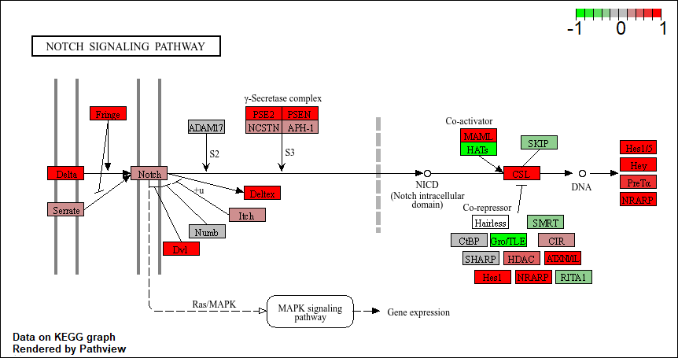
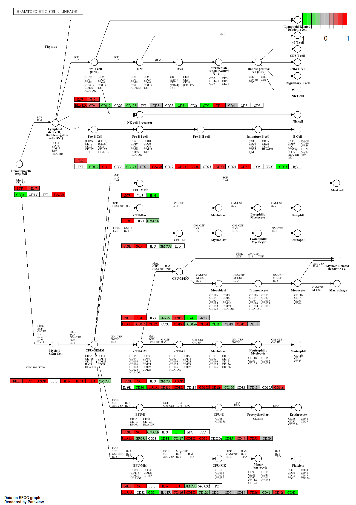

## Background
Analysis of high-throughput biological data typically yields a list of genes or proteins requiring further interpretation - for example the ranked lists of differentially expressed genes we have been generating from our RNA-seq analysis to date.

Our intention is typically to use such lists to gain novel insights about genes and proteins that may have roles in a given phenomenon, phenotype or disease progression. However, in many cases these 'raw' gene lists are challenging to interpret due to their large size and lack of useful annotations. Hence, our expensively assembled gene lists often fail to convey the full degree of possible insight about the condition being studied.

Pathway analysis (also known as gene set analysis or over-representation analysis), aims to reduce the complexity of interpreting gene lists via mapping the listed genes to known (i.e. annotated) biological pathways, processes and functions.

## Data import
You can download the count data and associated metadata from here: GSE37704_featurecounts.csv and GSE37704_metadata.csv.

```{r}
library(DESeq2)

#load our data files
metaFile <- "GSE37704_metadata.csv"
countFile <- "GSE37704_featurecounts.csv"

# Import metadata and take a peek
colData = read.csv(metaFile, row.names=1)
head(colData)
```

```{r}
# Import countdata
countData = read.csv(countFile, row.names=1)
head(countData)
```

### Sanity Check

>Q. Complete the code below to remove the troublesome first column from countData

```{r}
countData <- as.matrix(countData[, -1])
head(countData)
```

>Q. Complete the code below to filter countData to exclude genes (i.e. rows) where we have 0 read count across all samples (i.e. columns).

```{r}
countData <- countData[rowSums(countData) != 0, ]
head(countData)
```

## Setup DESeq object

```{r}
dds <- DESeqDataSetFromMatrix(
  countData = countData,
  colData = colData,
  design = ~ condition
)

dds <- DESeq(dds)

dds
```

## Run DESeq analysis pipeline

Next, get results for the HoxA1 knockdown versus control siRNA

```{r}
res = results(dds)
```

## Extract the results
Big table with log2 fold changes and p-values

>Q. Call the summary() function on your results to get a sense of how many genes are up or down-regulated at the default 0.1 p-value cutoff.

```{r}
summary(res)
```


## Data Visualization
Now we will make a volcano plot, a commonly produced visualization from this type of data that we introduced last day. Basically it's a plot of log2 fold change vs -log adjusted p-value.

```{r}
library(ggplot2)

ggplot(res) +
  aes(log2FoldChange,
      -log10(padj)) +
  geom_point()
```
>Q. Improve this plot by completing the below code, which adds color, axis labels and cutoff lines:

```{r}
# Make a color vector for all genes
mycols <- rep("gray", nrow(res))

# Color blue the genes with fold change above 2
mycols[ abs(res$log2FoldChange) > 2 ] <- "blue"

# Color gray those with adjusted p-value more than 0.01
mycols[ res$padj > 0.01 ] <- "gray"

ggplot(res) +
  aes(log2FoldChange,
      -log10(padj)) +
  geom_point(color = mycols) +
  xlab("Log2(FoldChange)") +
  ylab("-Log(P-value)") +
  geom_vline(xintercept = c(-2, 2)) +
  geom_hline(yintercept = -log10(0.01))
```


## Add Annotation data
Add gene symbol and entrez ids

>Q. Use the mapIDs() function multiple times to add SYMBOL, ENTREZID and GENENAME annotation to our results by completing the code below.

```{r}
library("AnnotationDbi")
library("org.Hs.eg.db")

columns(org.Hs.eg.db)

res$symbol = mapIds(org.Hs.eg.db,
                    keys = row.names(res), 
                    keytype = "ENSEMBL",
                    column = "SYMBOL",
                    multiVals = "first")

res$entrez = mapIds(org.Hs.eg.db,
                    keys = row.names(res),
                    keytype = "ENSEMBL",
                    column = "ENTREZID",
                    multiVals = "first")

res$name = mapIds(org.Hs.eg.db,
                  keys = row.names(res),
                  keytype = "ENSEMBL",
                  column = "GENENAME",
                  multiVals = "first")

head(res, 10)
```

>Q. Finally for this section let's reorder these results by adjusted p-value and save them to a CSV file in your current project directory.

```{r}
res <- res[order(res$padj), ]

write.csv(res, file = "deseq_results.csv")
```


## Pathway analysis 
KEGG, GO, and REactome

Here we are going to use the gage package for pathway analysis. Once we have a list of enriched pathways, we're going to use the pathview package to draw pathway diagrams, shading the molecules in the pathway by their degree of up/down-regulation.

```{r}
library(pathview)
library(gage)
library(gageData)

data(kegg.sets.hs)
data(sigmet.idx.hs)

# Focus on signaling and metabolic pathways only
kegg.sets.hs = kegg.sets.hs[sigmet.idx.hs]

# Examine the first 3 pathways
head(kegg.sets.hs, 3)
```
The main `gage()` function requires a named vector of fold changes, where the names of the values are the Entrez gene IDs.

Note that we used the `mapIDs()` function above to obtain Entrez gene IDs (stored in `res$entrez`) and we have the fold change results from DESeq2 analysis (stored in `res$log2FoldChange`).

```{r}
foldchanges = res$log2FoldChange
names(foldchanges) = res$entrez
head(foldchanges)
```

Now, let’s run the **gage** pathway analysis.
```{r}
# Get the results
keggres = gage(foldchanges, gsets=kegg.sets.hs)

#look at the object returned
attributes(keggres)
```

Look at the first few down pathways.

```{r}
head(keggres$less)
```
Now, let's try out the `pathview()` function from the pathview package to make a pathway plot with our RNA-Seq expression results shown in color.

```{r}
pathview(gene.data=foldchanges, pathway.id="hsa04110")
```
```{r}
knitr::include_graphics("hsa04110.pathview.png")
```
Now, let's process our results a bit more to automagicaly pull out the top 5 upregulated pathways, then further process that just to get the pathway IDs needed by the `pathview()` function. We'll use these KEGG pathway IDs for pathview plotting below.

```{r}
## Focus on top 5 upregulated pathways here for demo purposes only
keggrespathways <- rownames(keggres$greater)[1:5]

# Extract the 8 character long IDs part of each string
keggresids = substr(keggrespathways, start=1, stop=8)
keggresids
```
Finally, lets pass these IDs in keggresids to the pathview() function to draw plots for all the top 5 pathways.

```{r}
pathview(gene.data=foldchanges, pathway.id=keggresids, species="hsa")
```






>Q. Can you do the same procedure as above to plot the pathview figures for the top 5 down-regulated pathways?

```{r}
## Focus on top 5 downregulated pathways
keggrespathways.down <- rownames(keggres$less)[1:5]

# Extract the 8-character KEGG pathway IDs
keggresids.down <- substr(keggrespathways.down, start = 1, stop = 8)

keggresids.down
```
```{r}
# Plot pathview figures for top 5 downregulated pathways
pathview(gene.data = foldchanges, pathway.id = keggresids.down, species = "hsa")
```


## Gene Ontology

```{r}
data(go.sets.hs)
data(go.subs.hs)

# Focus on Biological Process subset of GO
gobpsets = go.sets.hs[go.subs.hs$BP]

gobpres = gage(foldchanges, gsets=gobpsets)

lapply(gobpres, head)
```


## Reactome Analysis

```{r}
sig_genes <- res[res$padj <= 0.05 & !is.na(res$padj), "symbol"]
print(paste("Total number of significant genes:", length(sig_genes)))

write.table(sig_genes, file="significant_genes.txt", row.names=FALSE, col.names=FALSE, quote=FALSE)
```

>Q: What pathway has the most significant “Entities p-value”? Do the most significant pathways listed match your previous KEGG results? What factors could cause differences between the two methods?

The pathways with the most significant Entities p-value was Cell Cycle and Cell Cycle, Mitotic. These results generally match the previous KEGG pathway analysis where cell-cycle related pathways were also among the most signficant enriched pathways. The results may not match percetly because the two methods use different pathway databases and analysis approaches. They do not define pathways in the exact same way. 