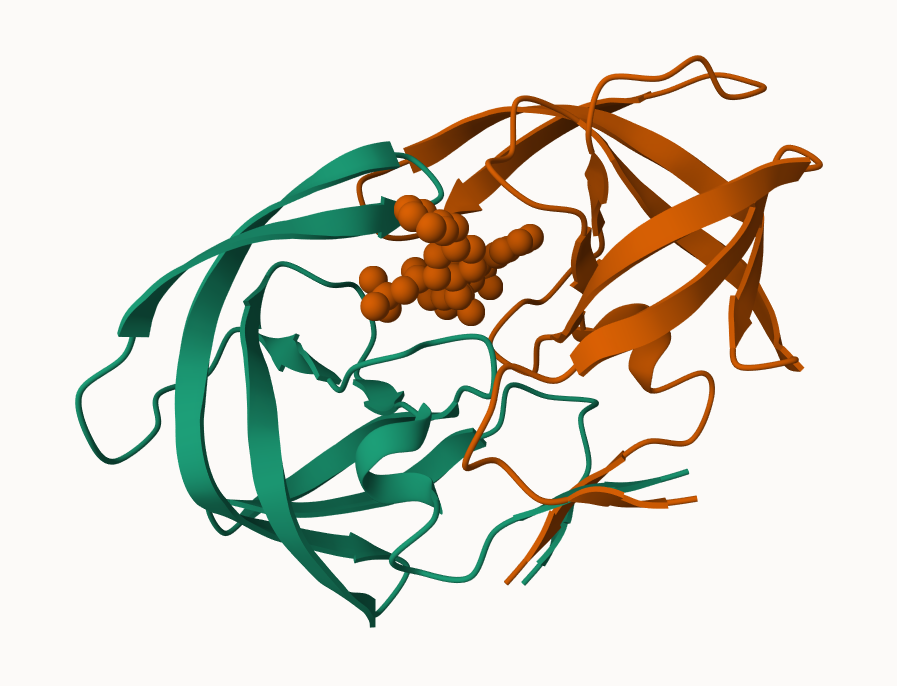
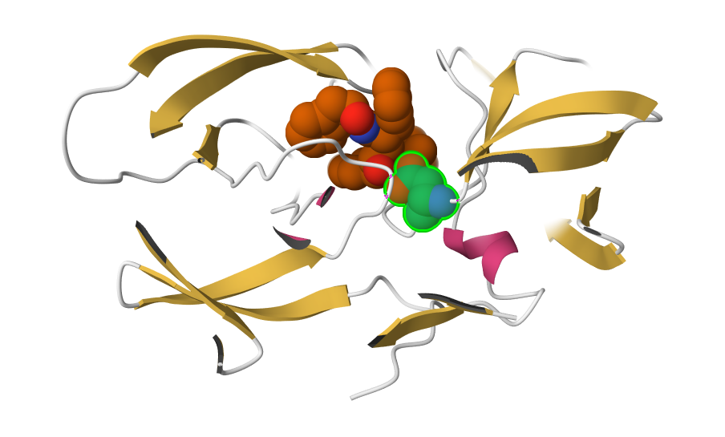

## Intro to the RCSB and PDB Statistics

Read a CSV file of current PDB stats obtained from https://www.rcsb.org/stats/summary 

```{r}
pdb <- read.csv("data.csv")
pdb
```

>Q1: What percentage of structures in the PDB are solved by X-Ray and Electron Microscopy.

```{r}
pdb$X.ray
```

```{r}
pdb$EM
```

This printout above `pb$X.ray` is "character" not "numeric". I can't do math with it so to fix it:

```{r}
#changing the printout to numeric using gsub()

pdb <- read.csv("data.csv", check.names = FALSE)

pdb$`X-ray` <- as.numeric(gsub(",", "", pdb$`X-ray`))
pdb$EM <- as.numeric(gsub(",", "", pdb$EM))
pdb$Total <- as.numeric(gsub(",", "", pdb$Total))

#Now that the printout is numeric I can calculate the percentages

xray_percent <- sum(pdb$`X-ray`) / sum(pdb$Total) * 100
em_percent <- sum(pdb$EM) / sum(pdb$Total) * 100

xray_percent
em_percent
```
80.5% are solved by X-Ray crystallography while 13.4% are solved by Electron Microscopy


>Q2: What proportion of structures in the PDB are protein?

```{r}
protein <- 217375
total <- 253205

protein/total
```

85.8% of the structures in the PDB are protein(only)

The total number of protein sequences in uniprot is 202,556,314

```{r}
217375/202556314 *100
```

**We have a very small structural coverage of known proteins (~.1%). Most structures we know (~80%) came from one method (X-ray crystalography)**

>Q3: Type HIV in the PDB website search box on the home page and determine how many HIV-1 protease structures are in the current PDB?

There are 1,147 HIV-1 protease structures in the current PDB.

## Visualizing the HIV-1 protease structure




>Q4: Water molecules normally have 3 atoms. Why do we see just one atom per water molecule in this structure?

We see one atom per water molecules because in most X-ray crystal structures the hydrogen atoms of water are not visible. The PDB structures usually only include the oxygen atom of each water molecule.

>Q5: There is a critical “conserved” water molecule in the binding site. Can you identify this water molecule? What residue number does this water molecule have

HOH 308

>Q6: Generate and save a figure clearly showing the two distinct chains of HIV-protease along with the ligand. You might also consider showing the catalytic residues ASP 25 in each chain and the critical water (we recommend “Ball & Stick” for these side-chains). Add this figure to your Quarto document.


## Introduction to Bio3D in R

Bio3D is an R package for structural bioinformatics. Features include the ability to read, write and analyze biomolecular structure, sequence and dynamic trajectory data.

In your existing Rmarkdown document load the Bio3D package by typing in a new code chunk:

```{r}
library(bio3d)
pdb <- read.pdb("1hsg")
pdb
```
>Q7: How many amino acid residues are there in this pdb object? 

There are 198 amino acid residues in this pdb object.

>Q8: Name one of the two non-protein residues? 

One non-protein residue is HOH.

>Q9: How many protein chains are in this structure?

There are 2 protein chains in this structure.


We can use the Bio3D partner package, bio3dview, to generate quick interactive molecular visualizations. To install the development version of bio3dview from GitHub, along with the related NGLVieweR package use:

```{r}
##install.packages("remotes")
##remotes::install_github("bioboot/bio3dview")
##install.packages("NGLVieweR")

```
```{r}
library(bio3dview)
library(NGLVieweR)

##view.pdb(pdb) |>
 ## setSpin()
```

```{r}
# Select the important ASP 25 residue
#sele <- atom.select(pdb, resno=25)

# and highlight them in spacefill representation
#view.pdb(pdb, cols=c("navy","teal"), 
       #  highlight = sele,
       #  highlight.style = "spacefill") |>
 # setRock()
```

Let's read a new PDB structure of Adenylate Kinase and perform Normal mode analysis:

```{r}
adk <- read.pdb("6s36")
adk
```
Normal mode analysis (NMA) is a structural bioinformatics method to predict protein flexibility and potential functional motions (a.k.a. conformational changes).

```{r}
# Perform flexiblity prediction
m <- nma(adk)
plot(m)
```

To view a “movie” of these predicted motions we can generate a molecular “trajectory” with the `mktrj()` function.

```{r}
mktrj(m, file="adk_m7.pdb")
```


Alternatively, for a quicker display you can use the view.nma() function from the bio3dview package mentioned previously:

```{r}
#view.nma(m, pdb=adk)

```


## Comparitive structure analysis of Adenylate Kinase

The goal of this section is to perform principal component analysis (PCA) on the complete collection of Adenylate kinase structures in the protein data-bank (PDB).

```{r}
##install.packages("BiocManager")
##BiocManager::install("msa")
```

>Q10. Which of the packages above is found only on BioConductor and not CRAN? 

msa is only found on Bioconductor and not CRAN.

>Q11. Which of the above packages is not found on BioConductor or CRAN?: 

bio3dview is not found on Bioconductor or CRAN.

>Q12. True or False? Functions from the pak package can be used to install packages from GitHub and BitBucket? 

True, functions from the pak package can be used to install packages from Github and BitBucket.


Below we perform a blast search of the PDB database to identify related structures to our query Adenylate kinase (ADK) sequence.

```{r}
library(bio3d)
aa <- get.seq("1ake_A")
aa
```

>Q13. How many amino acids are in this sequence, i.e. how long is this sequence? 

There are 214 amino acids in this sequence.

```{r}
hits <- NULL
hits$pdb.id <- c('1AKE_A','6S36_A','6RZE_A','3HPR_A','1E4V_A','5EJE_A','1E4Y_A','3X2S_A','6HAP_A','6HAM_A','4K46_A','3GMT_A','4PZL_A')


# Download releated PDB files
files <- get.pdb(hits$pdb.id, path="pdbs", split=TRUE, gzip=TRUE)
```


Next we will use the `pdbaln()` function to align and also optionally fit (i.e. superpose) the identified PDB structures.

```{r}
# Align releated PDBs
pdbs <- pdbaln(files, fit = TRUE, exefile="msa")
```
We can view our superposed results with the new bio3dview `view()` function:

```{r}
library(bio3dview)

##view.pdbs(pdbs)
```

The function `pdb.annotate()` provides a convenient way of annotating the PDB files we have collected. Below we use the function to annotate each structure to its source species. This will come in handy when annotating plots later on:

```{r}
# Vector containing PDB database codes
ids <- basename.pdb(pdbs$id)

anno <- pdb.annotate(ids)
unique(anno$source)
```

## Principal component analysis

```{r}
# Perform PCA
pc.xray <- pca(pdbs)
plot(pc.xray)

```

Function `rmsd()` will calculate all pairwise RMSD values of the structural ensemble. This facilitates clustering analysis based on the pairwise structural deviation:

```{r}
# Calculate RMSD
rd <- rmsd(pdbs)

# Structure-based clustering
hc.rd <- hclust(dist(rd))
grps.rd <- cutree(hc.rd, k=3)

plot(pc.xray, 1:2, col="grey50", bg=grps.rd, pch=21, cex=1)
```
To visualize the major structural variations in the ensemble the function `mktrj()` can be used to generate a trajectory PDB file by interpolating along a give PC (eigenvector):

```{r}
# Visualize first principal component
pc1 <- mktrj(pc.xray, pc=1, file="pc_1.pdb")
```
We can also view our results with the new bio3dview view() function:

```{r}
##view.pca(pc.xray)
```

We can also plot our main PCA results with **ggplot**:

```{r}
#Plotting results with ggplot2
library(ggplot2)
library(ggrepel)

df <- data.frame(PC1=pc.xray$z[,1], 
                 PC2=pc.xray$z[,2], 
                 col=as.factor(grps.rd),
                 ids=ids)

p <- ggplot(df) + 
  aes(PC1, PC2, col=col, label=ids) +
  geom_point(size=2) +
  geom_text_repel(max.overlaps = 20) +
  theme(legend.position = "none")
p
```


